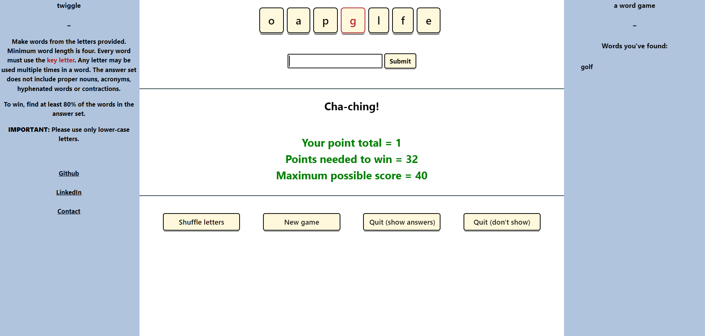

# twiggle (second pass)

## Introduction

twiggle is a word game.  The player uses a set of seven letters to make as many words as possible.  One of the seven letters is designated the key letter and every word made must use that letter at least once.  All letters may be used multiple times in a given word.  Proper nouns, acronyms, hyphenated words and contractions are not valid answers.

Below is a picture of the one and only page.

## Technologies Used

twiggle was created using JavaScript, HTML and CSS.

## Getting Started

When I started learning to code I knew I would want to create a game like this.  After I got the first version working I immediately began planning this version. 

## Unsolved Problems

There aren't any critical unsolved problems.    

## Future Enhancements

This is a big improvement on the first version but there is plenty of work to be done.      

## Miscellaneous
If you want access to the files you can fork and clone this repository to your machine.  

To play the game, visit https://johnvresilovic.github.io/twiggle/

Contact info: 
https://linkedin.com/in/john-vresilovic